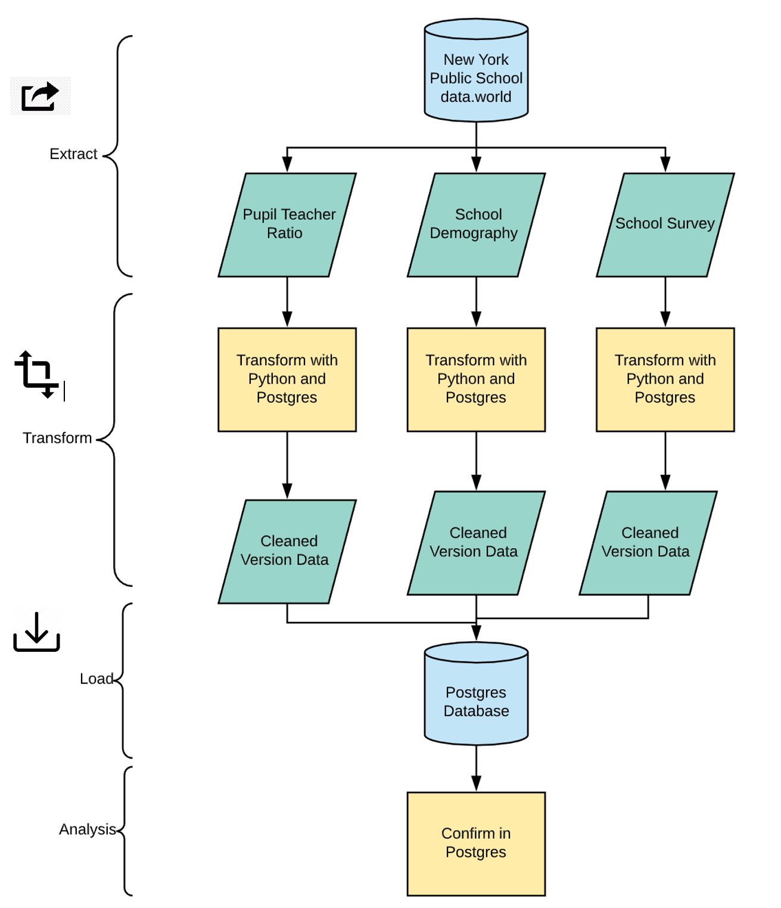

# Project 2 - ETL Project

### 1. Background 

**Project Background: ** This ETL project requires us to perform Extract, Transform, and Load process from a data source to a new database. 

**Why we chose the dataset: ** We are interested to see a dataset which has correlation among them. We chose New York public school dataset because it has the same unique value (School ID and school name) among every data files. 
For every CSV file, it consists of several variables such pupil to teacher ratio, demography, and school survey result. 
Later on, we are interested if the school quality (reflected by school survey result) has an impact from  gender demography and pupil to teacher ratio. 

However, in this project, we only focus on the ETL part. The analysis and the visualization is not included in the project scope. 

* The three data source tables (`pupil_teacher_ratio`, `school_demography`, `school_survey`) can be found in resource folder.

### 2. Methodology

These are the steps we did in achieving the result. 

### 3. Extract

a. **Data Source: **Three CSV files from City of New York dataset in data.world.  https://data.world/city-of-ny

b. We extracted the CSV files with Python and read it as Pandas Dataframe. 

### 4. Transform

We did the transformation part in two environments. The first one is with Python and the second one is in Postgres. 
Using Python, we did several data cleaning such as delete column, rename, and formatting.  

a. First table: pupil_teacher ratio

In this table, first we rename all columns in this table and we set the index into id. The table columns remain the same

b. Second table: school_demography

In this table, we selected only several columns that are relevant to our projects. In this case, we only select gender demography columns (percentage female and percentage male). 
Since the data shows for several years, we narrowed down the data only for 2015-2016 year. 
And the we rename the columns, format the number, and set ID as index. 

b. Third table: school_survey

We selected columns that are relevant to our project, which are school survey columns. 
There are many other interesting criteria in the table (when the score result is divided into several criteria) but due to time limitation, we decided to focus on the survey with numbers. 
We rename the columns (so it will have the same consistency with other files) and did number formatting. 

* File output is `etl_project.ipynb` 

### 5. Load

We created a new Postgres database. School id becomes the Primary Key and Foreign Key.  

### 6. Analysis

After we load the database, we joined the tables to see the combined output with school id as  the Primary key. 

After its confirmed that all the tables are loaded in database, this dataset is ready to be analyzed. 
In the future, we can see the relationship and correlation among the variables such as the impact of gender demography and pupil teacher ratio to selected school quality. 

* File output is `ETL-export.sql` 

